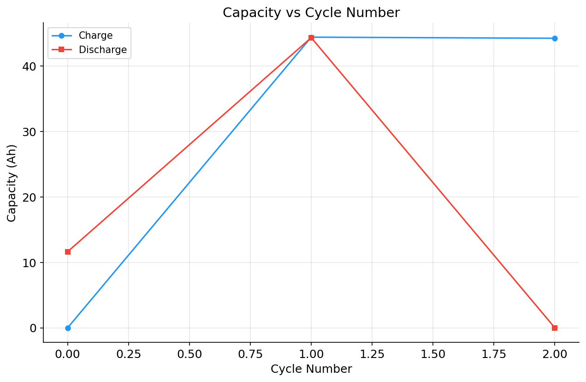
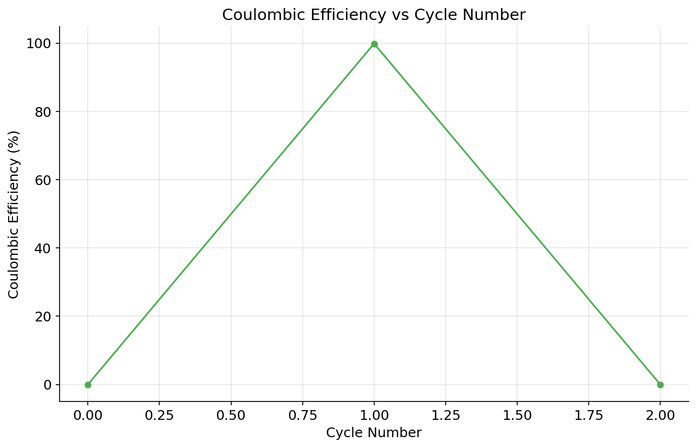
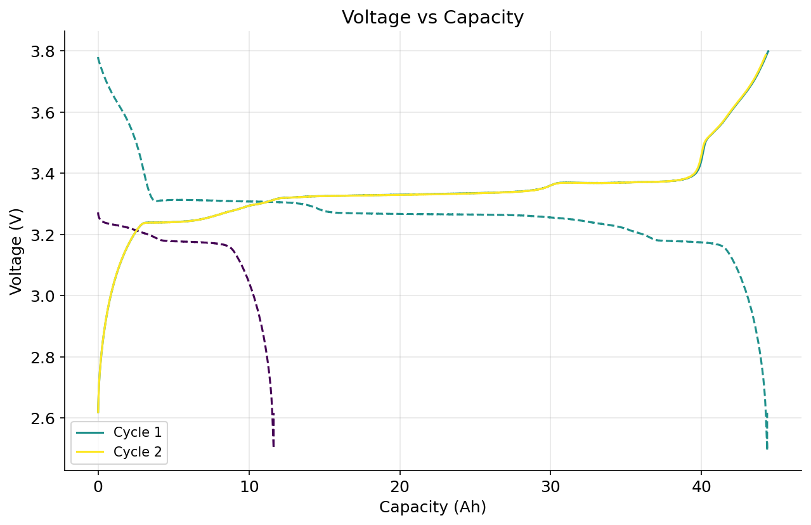
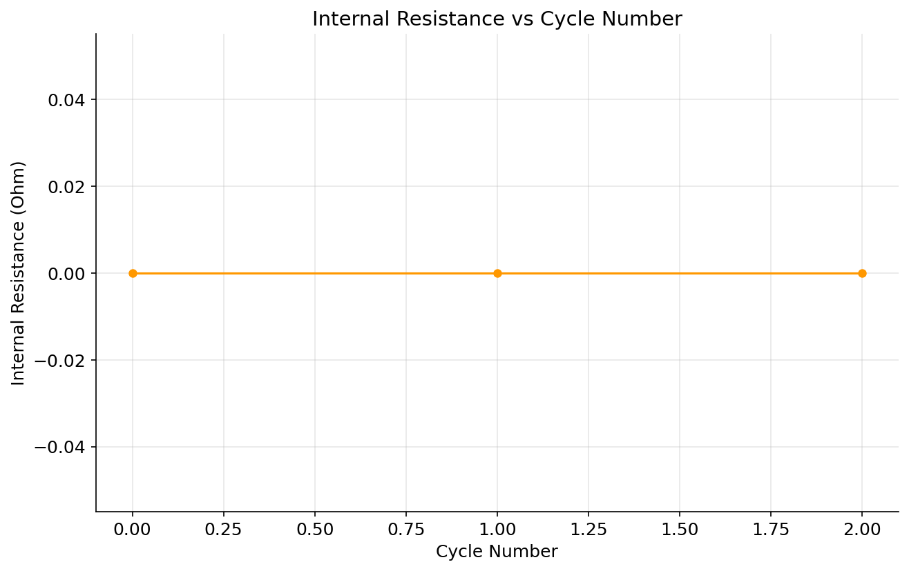

# Battery Analysis Report

**Generated:** 2026-03-30 (example)
**Source File:** data/examples/pec.csv
**Test Name:** SAFT VL43EFe dQdV C/25
**Start Time:** 2019-02-22 16:21:35

---

## Summary

| Metric | Value |
|--------|-------|
| Total Data Points | 16255 |
| Total Cycles | 3 |
| Voltage Range | 2.494 - 3.800 V |
| Current Range | -1.641 - 1.641 A |
| Total Test Time | 89.72 h |

## Key Findings

- Excellent capacity retention — minimal degradation observed.
- Coulombic efficiency is excellent, indicating minimal side reactions.
- Low voltage hysteresis indicates good kinetics and low polarization.

## Cycle Performance

| Cycle | Charge Cap (Ah) | Discharge Cap (Ah) | CE (%) | Energy Eff (%) | Capacity Retention (%) |
|-------|-----------------|-------------------|--------|---------------|----------------------|
| 0 | 0.0000 | 11.6342 | 0.00 | 0.00 | 100.00 |
| 1 | 44.4249 | 44.3520 | 99.84 | 97.67 | 381.22 |
| 2 | 44.2589 | 0.0000 | 0.00 | 0.00 | 0.00 |

## Capacity Analysis

| Metric | Value |
|--------|-------|
| Initial Charge Capacity | 0.0 Ah |
| Initial Discharge Capacity | 11.634168 Ah |
| Final Discharge Capacity | 44.351991 Ah |
| Maximum Discharge Capacity | 44.351991 Ah (Cycle 1) |
| Minimum Discharge Capacity | 11.634168 Ah (Cycle 0) |
| Total Capacity Fade | -281.22% |
| Fade Rate | -32717.823 mAh/cycle |
| Final Retention | 381.22% |

## Efficiency Analysis

**Coulombic Efficiency:**

| Metric | Value |
|--------|-------|
| Mean CE | 99.84% |
| CE Std Dev | 0.0% |
| Min CE | 99.84% (Cycle 1) |
| Max CE | 99.84% (Cycle 1) |

**Energy Efficiency:**

| Metric | Value |
|--------|-------|
| Mean Energy Efficiency | 97.67% |
| Min Energy Efficiency | 97.67% |
| Max Energy Efficiency | 97.67% |

## Voltage Analysis

| Metric | Value |
|--------|-------|
| Voltage Range | 2.4935 - 3.7998 V (1.3063 V span) |
| Avg End-of-Charge Voltage | 3.7936 V |
| Avg End-of-Discharge Voltage | 2.6171 V |
| Avg Voltage Hysteresis | 0.0736 V |

**Per-Cycle Voltage Hysteresis:**

| Cycle | Hysteresis (V) |
|-------|---------------|
| 1 | 0.0736 |

## Visualizations

### Capacity Fade

### Coulombic Efficiency

### Voltage Curves

### Internal Resistance

---

## Analysis Notes

- Data loaded from PEC CSV format with 16255 measurement points across 3 cycles.
- Average coulombic efficiency: 99.84% (σ = 0.0%).
- Average voltage hysteresis: 0.0736 V, indicating low polarization.

> **Note on capacity retention figures:** This example dataset contains only 3 partial cycles from a C/25 rate characterisation test. Cycle 0 has no charge step (discharge-only) and cycle 2 has no discharge step (charge-only), so the automated capacity-retention and capacity-fade calculations produce values outside the typical 0–100 % range. This is expected for incomplete cycle data; a production dataset with full charge–discharge cycles will yield conventional retention values.
